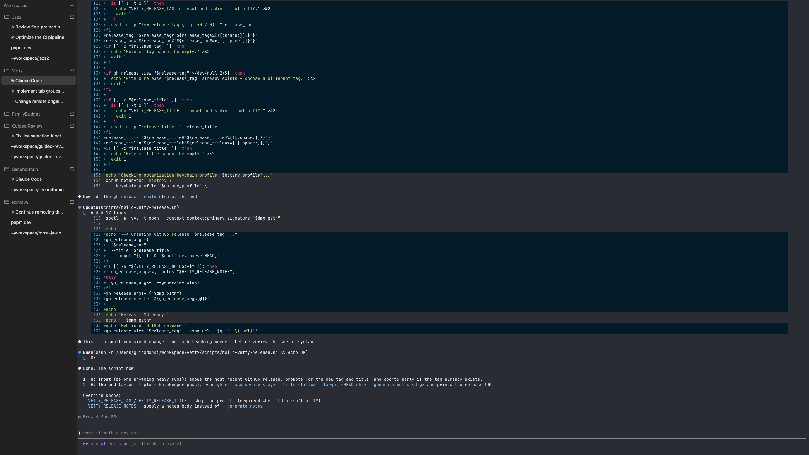

# Vetty

A macOS terminal that keeps Ghostty intact and adds a left sidebar for organizing tabs into workspaces and tab groups.



## What it is

Vetty wraps [Ghostty](https://ghostty.org/) — its rendering, input, shell handling, command palette, splits, search, and settings are all the upstream project. On top of that, Vetty adds one thing: a sidebar that lets you group related Ghostty tabs together.

```
Workspace
└── Tab group
    └── Ghostty tabs
```

Use a workspace per project, a tab group per task (e.g. *"Claude Code"*, *"Continue Reviews"*), and let Ghostty handle everything inside the tab.

If you hide the sidebar, Vetty behaves like a stock Ghostty build.

## Why use it

- **Project-scoped terminals.** A workspace per repo keeps shells, working directories, and tabs separate without juggling Ghostty windows.
- **Task-scoped tab groups.** Group the four tabs you opened for a single bug fix, collapse them when you're done, reopen later.
- **Ghostty underneath.** No fork of the terminal model, no second renderer — upstream Ghostty improvements flow in.
- **Native macOS app.** Signed, notarized, hardened-runtime, and distributed as a DMG.

## Install

Download the latest `.dmg` from the [Releases page](https://github.com/gdorsi/vetty/releases), open it, and drag `Vetty.app` into `/Applications`.

The first launch may take a moment while macOS verifies the notarization ticket.

## Requirements

- macOS 14 (Sonoma) or later
- Apple Silicon

## Configuration

Vetty reads the same configuration as Ghostty (`~/.config/ghostty/config`). Fonts, themes, keybindings, and shell integration all work the same way — see the [Ghostty documentation](https://ghostty.org/docs).

Sidebar state (workspaces, tab groups, order, selection) is stored separately by Vetty and persists across launches.

## Building from source

```bash
git clone https://github.com/gdorsi/vetty.git
cd vetty
./scripts/build-vetty-debug.sh
```

The debug script produces an unsigned `Vetty.app` under `build/`. For signed/notarized release builds, see `scripts/build-vetty-release.sh` — it documents the required environment (signing identity, notary profile, team ID).

## License

Ghostty is vendored under its original license — see `ghostty/LICENSE`. Vetty's own sources follow the same terms.
